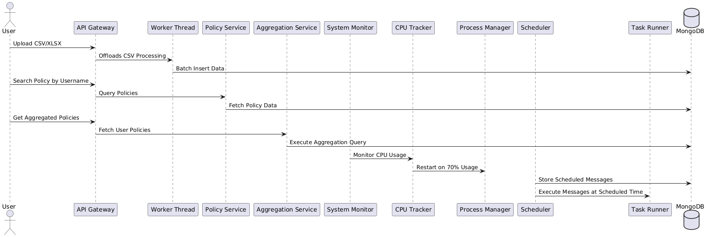
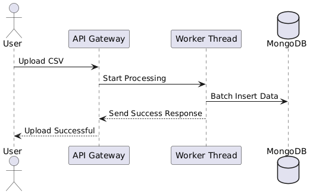
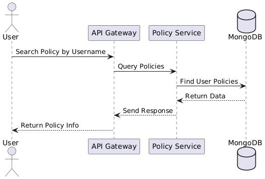

# **Node.js Backend Assessment - README**

## **1. Overview**
This project is a backend system implemented using **Node.js, MongoDB, and worker threads**. It efficiently processes CSV/XLSX data, provides policy search and aggregation APIs, tracks CPU usage, and schedules messages.

## **2. System Architecture**

### **Architecture Diagram**



## **3. Features & Implementation**

### **Task 1: Data Ingestion & API Development**
#### ✅ **CSV Upload Using Worker Threads**
- **Used worker threads** to process CSV files asynchronously.
- **Batch insertions** to improve efficiency.

#### ✅ **Search API - Get Policy by Username**
- **Indexed queries** for optimal performance.
- **Lean queries** to reduce memory overhead.

#### ✅ **Aggregation API - Policies by User**
- **MongoDB Aggregation Pipeline** for optimized grouping.
- **Efficient `$lookup` joins** for related collections.

### **Task 2: System Monitoring & Scheduling**
#### ✅ **CPU Monitoring & Auto-Restart**
- **Tracks CPU usage** using `pidusage`.
- **Auto-restarts** server at 70% CPU utilization.

#### ✅ **Scheduled Message Service**
- **Uses MongoDB & Agenda.js** for scheduled execution.
- **Ensures job persistence** even after restarts.

## **4. Sequence Diagrams**

### **CSV Upload Process**



### **Policy Search API**


## **5. Installation & Running Instructions**

### **Prerequisites**
- **Node.js v18+**
- **MongoDB (Local or Atlas)**
- **PM2 for process management**

### **Setup & Run**
```sh

# Install Dependencies
npm install

# Set up environment variables
cp .env.example .env

# Start the Application
npm run start
```

### **API Endpoints**
- **Upload CSV**: `POST /api/upload`
- **Search Policy**: `GET /api/policies?username=JohnDoe`
- **Get Aggregated Policies**: `GET /api/policies/aggregate`
- **Schedule Message**: `POST /api/schedule/message`

## **6. Conclusion**
This project demonstrates **efficient data processing, robust API development, real-time monitoring, and job scheduling**, making it **scalable and production-ready**.

